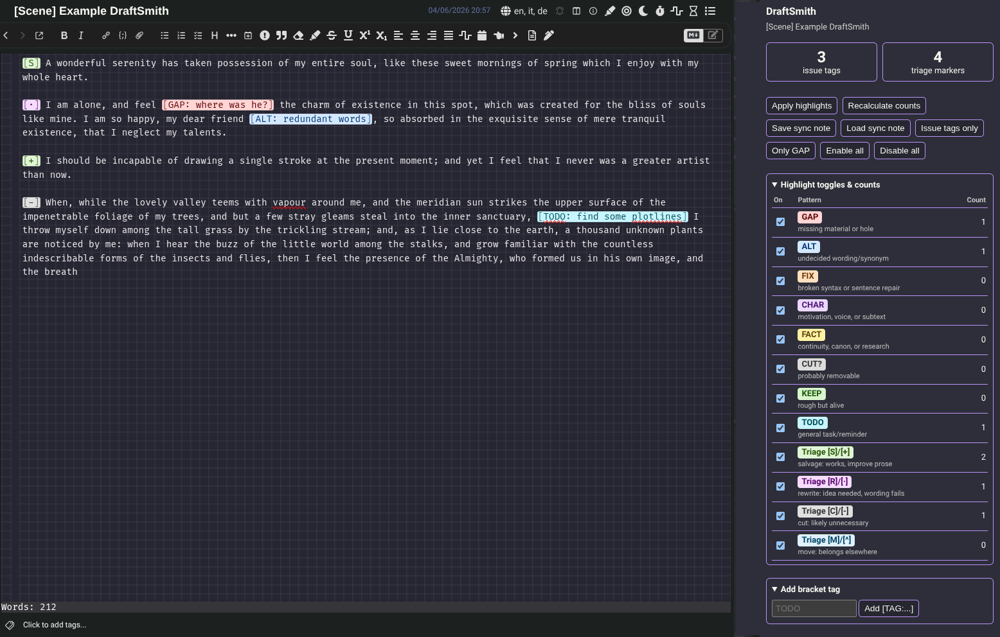

# DraftSmith

DraftSmith is a Joplin plugin for writers who revise messy Markdown drafts with bracketed editing tags such as `[GAP: ...]`, `[ALT: ...]`, `[CHAR: ...]`, and triage markers such as `[R]`, `[C]`, `[+]`, or `[-]`.

It helps turn an unfinished first draft into a manageable revision queue by highlighting tags in the editor, counting unresolved issues, and giving you a compact dashboard for pass-based editing.

## Screenshots





- [ ] Todo: make screenshots


## System this plugin is based on

DraftSmith implements a Joplin-friendly version of the editing workflow described in these two companion documents:

- [Ugly Draft → Polished Story: Editing System](ugly-draft-to-polished-story-editing-system.md)
- [Joplin Ugly Draft Workflow and Plugin Plan](joplin-ugly-draft-workflow-and-plugin-plan.md)

The core idea: do not try to make a chaotic draft beautiful immediately. First make it tagged, legible, functional, alive, and only then polished.

## Current version

`0.2.4` [Get it here :palm_up_hand:](joplin-plugin-draftsmith/publish/com.arena.draftSmith.jpl)

## Installable plugin file

After building, the installable `.jpl` is:

```text
publish/com.arena.draftSmith.jpl
```

## Main features

### Editor highlighting

DraftSmith highlights configurable bracket patterns directly in Joplin's Markdown editor.

Default issue tags:

```markdown
[GAP: ...]    missing material or hole
[ALT: ...]    undecided wording/synonym
[FIX: ...]    broken syntax or sentence repair
[CHAR: ...]   motivation, voice, or subtext
[FACT: ...]   continuity, canon, or research
[CUT?: ...]   probably removable
[KEEP: ...]   rough but alive
[TODO: ...]   general task/reminder
```

### Triage markers and aliases

Triage markers share colors/counts with their aliases:

```markdown
[S] or [+]    salvage: works, improve prose       | enhances the scene
[R] or [·]    rewrite: idea needed, wording fails | does not contribute to the scene
[C] or [-]    cut: likely unnecessary             | lowers the value of the scene
[M] or [^]    move: belongs elsewhere
```

### Overview panel

The DraftSmith panel shows:

- total issue tags in the selected note,
- total triage markers,
- per-pattern counts,
- per-pattern highlight toggles,
- short descriptions for each tag,
- quick modes such as `Only GAP`, `Issue tags only`, `Enable all`, and `Disable all`,
- `Apply highlights` and `Recalculate counts`,
- sync note import/export buttons.

On desktop, this is a side panel. On mobile, it should appear through Joplin's plugin panel/dialog UI.

### Settings

Each tag has separate, clearer settings:

```text
GAP: highlight enabled
GAP: background color
GAP: text color
```

Joplin's settings API does not currently provide a way to place these three controls on one custom row like:

```text
GAP [toggle] [background] [text]
```

So DraftSmith uses separate settings fields rather than a compact but less intuitive combined syntax.

Color settings accept:

```text
#ffd6d6
#5f0000
var(--joplin-code)
var(--joplin-color)
var(--joplin-background-color)
var(--joplin-code, #ffffff)
```

Only safe hex colors and safe `var(--...)` CSS custom properties are accepted.

### Advanced regex JSON

On desktop, DraftSmith exposes an advanced JSON setting for regex editing and custom pattern configuration.

On mobile, this large JSON field is hidden to avoid breaking or overwhelming the mobile settings screen.

### Sync note import/export

DraftSmith can save/load settings through a normal Joplin note so config can sync between desktop and mobile.

The default sync note title is:

```text
DraftSmith Settings
```

Panel buttons:

```text
Save sync note
Load sync note
```

There is also a setting:

```text
Sync note ID/ref
```

Expected format:

```text
:/<ID>
```

If this is set, DraftSmith uses that exact note for import/export. If it is empty, DraftSmith searches for or creates a note titled `DraftSmith Settings`. When it finds or creates a sync note, it stores its `:/<ID>` reference automatically.

## Suggested workflow

1. Mark messy draft interruptions with standardized tags:

   ```markdown
   [GAP: missing reaction]
   [ALT: trembling | shaking | unsteady]
   [CHAR: motivation unclear]
   [FACT: check canon timeline]
   [CUT?: redundant]
   ```

2. Open the DraftSmith panel.
3. Choose a pass mode:

   - Completion pass: enable `GAP` and `FIX`.
   - Synonym pass: enable `ALT`.
   - Character pass: enable `CHAR`.
   - Triage pass: enable `S/R/C/M` or aliases `[+]`, `[·]`, `[-]`, `[^]`.

4. Work one category at a time.
5. Recalculate counts.
6. Save/load the sync note if working across devices.

## Installation

### Install from file

1. Build or locate:

   ```text
   publish/com.arena.draftSmith.jpl
   ```

2. In Joplin Desktop or Joplin Mobile plugin settings, choose install from file.
3. Select the `.jpl`.
4. Restart Joplin.

Because the plugin was renamed from earlier development builds, uninstall any old `Ugly Draft Highlighter` build before installing DraftSmith.

### Development install

Point Joplin's development plugin path to this plugin folder, then restart Joplin.

### Build from source

```bash
npm install
npm run dist
```

The generated plugin appears in:

```text
publish/com.arena.draftSmith.jpl
```

## Short changelog

### 0.2.4

- Made the DraftSmith panel vertically scrollable while hiding scrollbars, so expanded details sections remain usable on small screens.

### 0.2.3

- Updated vulnerable development/build dependencies: `copy-webpack-plugin` and `tar`.
- `npm audit` now reports 0 vulnerabilities.

### 0.2.2

- Moved panel button/checkbox handlers from inline JavaScript to an external panel script to fix non-interactive desktop panel controls.

### 0.2.1

- Strengthened editor CSS so highlighted bracket tags override Joplin link-token text color as well as underline styling.

### 0.2.0

- Renamed plugin from `Ugly Draft Highlighter` to `DraftSmith`.
- Updated plugin ID, package name, commands, panel labels, sync note title, and README.

### 0.1.8

- Added safe CSS variable support for color settings, e.g. `var(--joplin-code)`.
- Added triage aliases: `[+]`, `[·]`, `[-]`, `[^]`.
- Migrated old built-in triage regexes to alias-aware regexes.

### 0.1.7

- Restored intuitive separate settings for enabled/background/text color.
- Added `Sync note ID/ref` with expected `:/<ID>` format.

### 0.1.6

- Added save/load sync note workflow.
- Added concise tag descriptions in the panel.
- Added custom tag persistence into JSON/settings.

### 0.1.5

- Fixed mobile panel inline JavaScript escaping bug.
- Exposed advanced JSON on desktop only.

### 0.1.4

- Reworked CodeMirror decoration handling for more reliable re-highlighting.
- Added explicit `Apply highlights` button.
- Removed color pickers from the mobile panel.

### 0.1.3

- Collapsed panel sections with `<details>`.
- Added editor-side config refresh polling.

### 0.1.2

- Removed underline/text decoration from highlighted tags.
- Added per-pattern settings and desktop `View > Toggle` menu item.

### 0.1.1

- Added manifest mobile support.

### 0.1.0

- Initial configurable bracket-tag highlighter and issue counter.

## Known limitations

- CodeMirror 6 only; legacy CodeMirror 5 support is not implemented.
- Mobile plugin support in Joplin can be more constrained than desktop.
- Advanced JSON is intentionally hidden on mobile.
- Settings layout is limited by Joplin's settings API; multi-control rows are not currently implemented.
- The plugin was built and iterated in an AI-assisted environment and should be tested carefully in your own Joplin setup.


> **AI development disclaimer:** This plugin was developed with substantial help from AI. The workflow, plugin architecture, code iterations, README structure, and debugging changes were all massively assisted by an AI coding agent. Please review, test, and audit before relying on it for important work.
